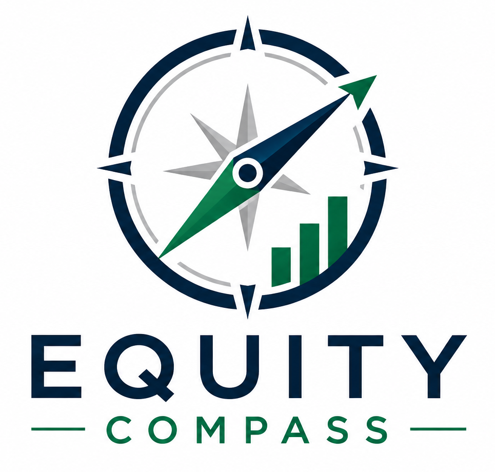

<div align="center">
  
  <h1>Equity Compass</h1>
  <p><strong>Understand a public company before you invest.</strong></p>
  <p>A beginner-friendly dashboard that turns SEC filings, financial history,<br>
  market data, and company news into clear, explainable research.</p>

  <p>
    
    
    
    
  </p>
</div>

---

## Phase 1 at a glance

Enter a supported U.S. stock ticker and Equity Compass builds a structured company
workspace from primary filings, market data, and recent coverage.

| Workspace | What it explains |
| --- | --- |
| **Overview** | Company profile, price movement, key financial signals, and long-term Equity Score |
| **Financials** | Five-year revenue, net income, EPS, cash flow, and balance-sheet trends |
| **Filings** | Latest 10-K, 10-Q, and 8-K reports with Business, Risk Factors, MD&A, and material events |
| **News & Events** | Recent company coverage, source links, sentiment context, and short-term market conditions |

### Two scores, two different questions

| Equity Score | Short-Term Score |
| --- | --- |
| Long-term company fundamentals | Current news and market conditions |
| Built from reported financial metrics | Built from recent price action and news signals |
| Transparent component breakdown | Separate from—and never changes—the Equity Score |

> Equity Compass is a research and education tool, not a valuation, forecast,
> investment rating, or recommendation.

### Phase 1 validation

End-to-end validated with **AAPL, JPM, XOM, TSLA, and NVDA**. All **138 automated
tests pass**, including missing-data, error-state, filing-extraction, scoring, and
corporate-successor coverage.

## Quick start

```bash
git clone https://github.com/zks10/EquityCompass.git
cd EquityCompass
python3 -m venv .venv
source .venv/bin/activate
python3 -m pip install -e .
export SEC_USER_AGENT="Equity Compass your-email@example.com"
streamlit run app.py
```

The first analysis may take a few minutes while source filings are downloaded and
processed. Later runs reuse the local data when possible.

## How it works

```text
Ticker search
    ├── SEC filings and financial facts ──> Equity Score
    ├── Market price and volume ──────────> Short-Term Score
    └── Recent company news ──────────────> News context
                         ↓
        Overview · Financials · Filings · News & Events
```

## Useful commands

| Command | Purpose |
| --- | --- |
| `equity-compass-pipeline AAPL --years 5` | Run the complete annual SEC pipeline |
| `quarterly-pipeline AAPL` | Process the latest 10-Q |
| `events-pipeline AAPL --limit 3` | Process recent 8-K events |
| `news-pipeline AAPL --days 7 --limit 20` | Collect recent company news |
| `recent-filings AAPL --limit 5` | List recent SEC filings |
| `resolve-company AAPL` | Resolve a ticker, company name, and SEC CIK |

## Project structure

```text
EquityCompass/
├── app.py              # Streamlit interface
├── finance_news/       # Data collectors, processing, scoring, and pipelines
├── tests/              # Automated test suite
├── assets/             # Brand assets
└── pyproject.toml      # Package configuration and CLI commands
```

## Tests

```bash
python3 -m unittest discover -s tests -v
```

The test suite uses simulated upstream responses and can run without repeatedly
contacting the SEC.

## Data sources

- **SEC EDGAR** — company identity, filings, and reported US-GAAP facts
- **Yahoo Finance** — market history and company profile data
- **Google News RSS** — recent public company coverage

External data can be delayed, incomplete, or temporarily unavailable. Equity Compass
shows missing-data and error states rather than inventing values.

## Next: Phase 2

Phase 2 will test whether historical Equity Scores were connected with stronger
later results. Read the plain-language [Phase 2 validation plan](docs/phase-2-validation-plan.md).
